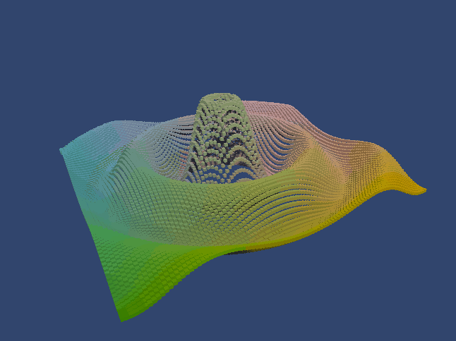
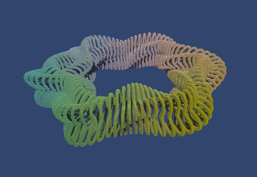

# Mathematical Surfaces
Unity project from the [Catlike Coding tutorial](https://catlikecoding.com/unity/tutorials/basics/mathematical-surfaces/)

## Examples:

### Ripple effect

### Sphere

### Ripple effect

## Covered in this tutorial:
- Created a function library
- Used a delegate and an enumeration type
- Displayed 2D functions with a grid
- Defined surfaces in 3D space

